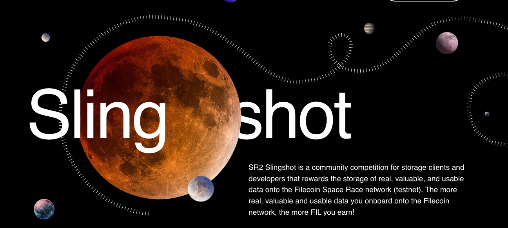

# [Space Race 2: Slingshot](https://slingshot.filecoin.io)

Welcome to the SR2 Slingshot repo! All participants must submit a project application to this repo according to the submission instructions. Once submitted, a panel of community reviewers will review your application to ensure that your project is eligible for the competition. If your application is accepted, reviewers will merge your PR. If not, they will leave comments on the PR asking you for more information.

## Submission Instructions

1. Please make a copy of the [`participants/template.md`](./participants/template.md) file.
2. Rename the file with your project's name.
3. Fill out all requested fields in the template.
4. Submit a PR to add your project's application to the `participants` folder in this repo.
5. Work with the community reviewers to approve your application!

## Leaderboard

Participants will be eligible for show up on the Leaderboard approximately 24 hours after the submitted PR is merged.  

For this information to appear correctly, please ensure that:
* Your client node matches up with your registration information.
* Your PR has been successfully merged.

If you need to update your registration information, please email the Slingshot team at slingshot@filecoin.org

## Help

The main competition rules and leaderboard can be found at [https://slingshot.filecoin.io](https://slingshot.filecoin.io).
µ
If you need help, please [join the Filecoin Slack](https://filecoin.io/slack) and join the following channels:
- **`#fil-testnet-announce`** -- For major announcements about the testnet and major software releases
- **`#slingshot-announcements`** -- For major announcements about the Slingshot program
- **`#slingshot`** -- For debugging help and community conversations throughout the course of the competition

If you need any additional assistance, feel free to email the Slingshot team at slingshot@filecoin.org

## Community Reviewers

 
| Photo | Name | Affiliation | Filecoin Slack | Github		   |
|-------|------|-------------|----------------|----------------|
| | Aaron Sutula   | Textile       | aaron               | asutula         |
| | Brett Shear    | Fleek         | Brett Shear         | Blockchainbrett |
| | Carson Farmer  | Textile       | Carson (textile.io) | carsonfarmer    |
| | Eva Shon       | Protocol Labs | eshon               | eshon           |
| |Greg Markou    | Chainsafe     | GregTheGreek        | GregTheGreek    |
| | Martina  Long  | Slate Team    | Martina Long        | martinalong     |
| | Matt Ober      | Pinata        | Matt Ober           | obo20           |
| | Michael Godsey | Infura        | Michael Godsey      | mbgodsey        |
| | Mike Goelzer   | Protocol Labs | Mike - Protocol Labs | mgoelzer        |
| | Neo            | IPFS Main     | Neo Ge              | NeoGe-IPFSMain  |
| |Steven Li   | IPFS Force     | Steven        | steven004 |
| |Harrison Hines    | Fleek     | Harrison Hines (Fleek) | hhterminal |  

## Miners

A Slingshot participant is alowed to make deals with any miner available on the Filecoin network and encouraged to interact with a variety of miners. 
(The rules specify a minimum of 3 miners to be eligible for rewards).  In order to facilitate miner discovery, this repository maintains a [list of
active miners](https://github.com/filecoin-project/slingshot/blob/master/miners.json) that are used by Textile's Hub, Powergate, and other solutions.  

This miner list in JSON format will continue to evolve and clients are encouraged to use this updated list.  Please note that this list is not intended as an endorsement and clients are free to use any other miner.

Any miner that meets the eligibilty criteria outlined below can be added to this [list](https://github.com/filecoin-project/slingshot/blob/master/miners.json) by opening a PR or commmenting on this [issue](https://github.com/filecoin-project/slingshot/issues/79).

The eligibility criteria include:
* The node is set to accept deal from any public client.
* The node is reachable (can respond to a query-ask network request)
* The node has power available.
* The node is using the correct lotus version (v0.80)

The list will remove any miners that don't meet the criteria above.
